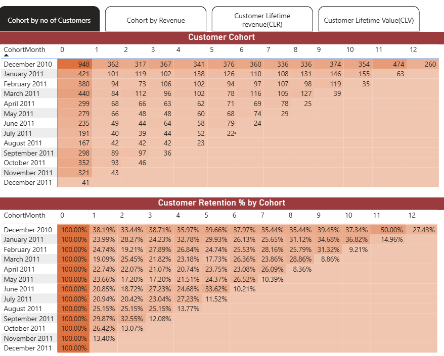
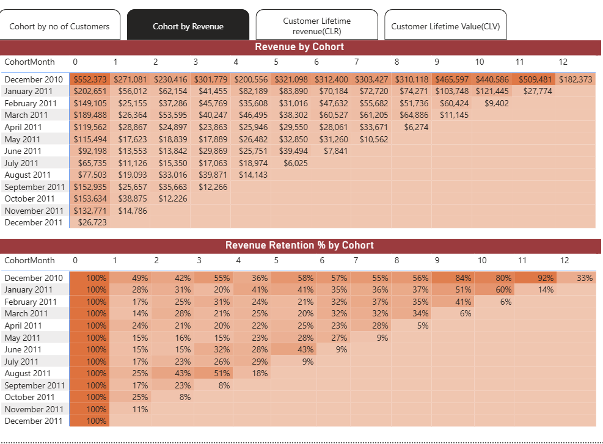
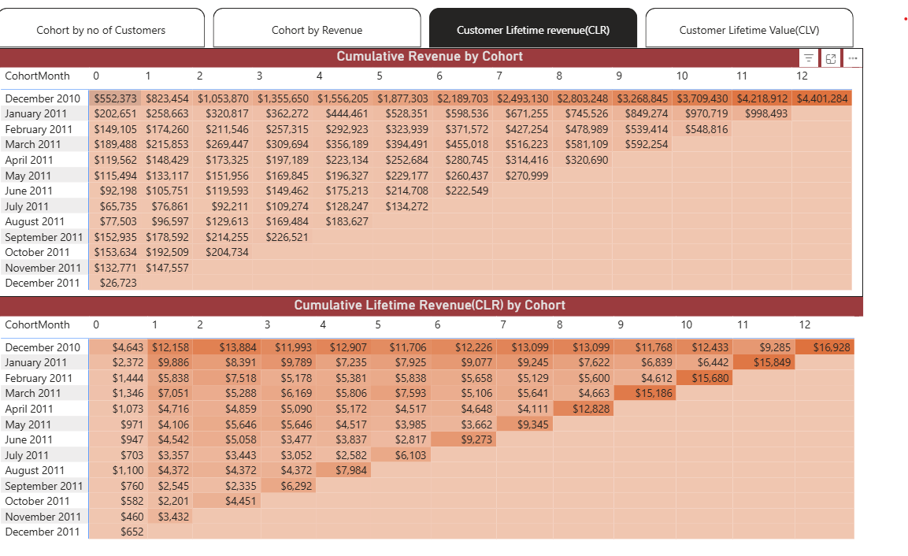
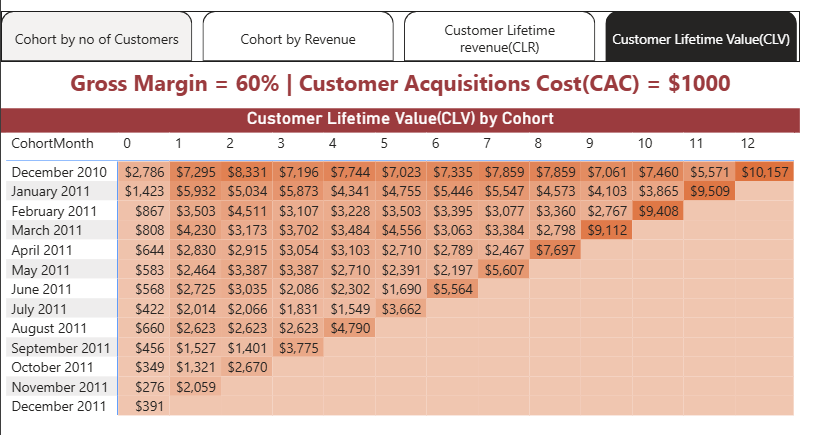

# Cohort Analysis Dashboard (Power BI)

## Overview
This project analyzes customer behavior over time using cohort analysis techniques. It focuses on retention, revenue trends, and customer lifetime value.

## Key Features
- Customer retention analysis by cohort
- Revenue retention tracking
- Cumulative revenue and customer lifetime value (CLV)
- Interactive matrix visuals using cohort indexing

## Tools & Technologies
- Power BI
- DAX
- Data Modeling

## Dashboard Screenshots

### Customer Retention

### Revenue Retention

### Customer Lifetime Revenue(CLR)

### Customer Lifetime Value (CLV)

## Insights
- Older cohorts show stabilization in retention over time
- Revenue retention provides deeper insight than customer count alone
- Customer lifetime value increases cumulatively across periods

## How to Use
Download the `Cohort Analysis Using PowerBI.pbix` file and open in Power BI Desktop.
